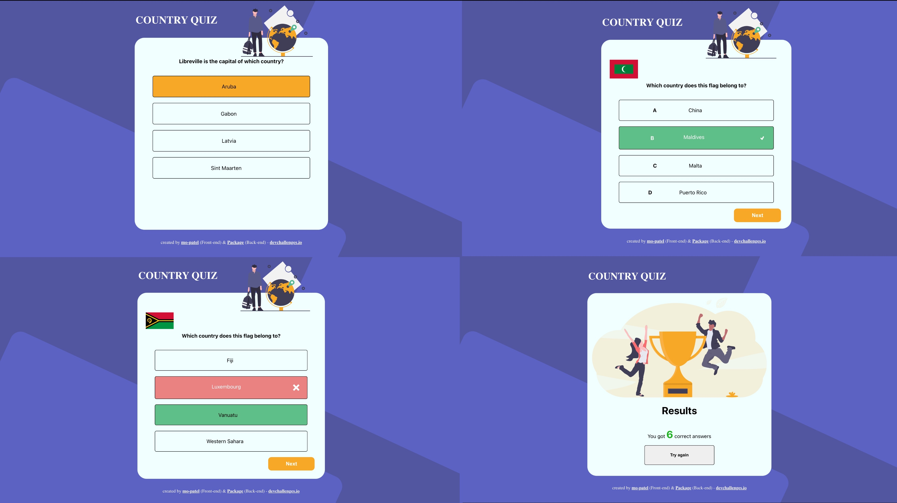

<h1 align="center">country-quiz</h1>

<div align="center">
   Solution for a challenge from  <a href="http://devchallenges.io" target="_blank">Devchallenges.io</a>
   Built with create-react-app.
</div>

<div align="center">
  <h3>
    <a href="https://country-quiz-orpin.vercel.app/">
      Demo
    </a>
    <span> | </span>
    <a href="https://github.com/mo-patel/country-quiz">
      Solution
    </a>
    <span> | </span>
    <a href="https://devchallenges.io/challenges/Bu3G2irnaXmfwQ8sZkw8#">
      Challenge
    </a>
  </h3>
</div>

<!-- TABLE OF CONTENTS -->

## Table of Contents

- [Overview](#overview)
  - [Built With](#built-with)
- [Features](#features)
- [How to use](#how-to-use)
- [Acknowledgements](#acknowledgements)

<!-- OVERVIEW -->

## Overview



### Built With

<!-- This section should list any major frameworks that you built your project using. Here are a few examples.-->

- [React](https://reactjs.org/)
- [CRA](https://create-react-app.dev/)
- [Typescript](https://www.typescriptlang.org/)

## Features

This application/site was created as a submission to a [DevChallenges](https://devchallenges.io/challenges) challenge. The [challenge](https://devchallenges.io/challenges/Bu3G2irnaXmfwQ8sZkw8) was to build an application to complete the given user stories.

<strong>Note:</strong> When there is an issue retrieving the data, the application will switch to local data. If you want to try again with live data, please refresh the page.

## How To Use
To clone and run this application, you'll need [Git](https://git-scm.com) and [Node.js](https://nodejs.org/en/download/) (which comes with [npm](http://npmjs.com)) installed on your computer. From your command line:

```bash
# Clone this repository
$ git clone https://github.com/mo-patel/country-quiz

# Install dependencies
$ npm install

# Run the app
$ npm start
```

## Acknowledgements

- Special credits to [@Package](https://github.com/Package) for creating the server side API which can be found [here](https://github.com/Package/countries-quiz-service-api).

